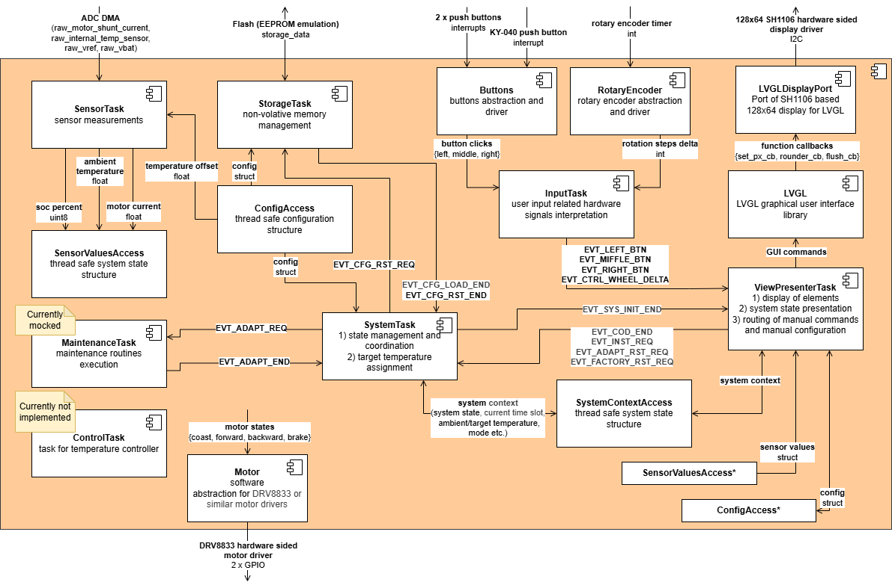
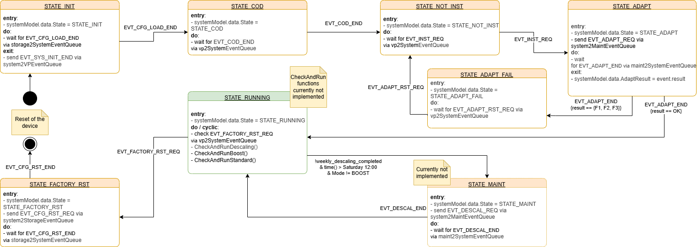

# MiraTherm Radiator Thermostat Software Architecture
This document describes the software architecture for the MiraTherm Radiator Thermostat. The software is written in C and utilizes FreeRTOS for real-time task scheduling and resource management.

The architecture follows a modular design separating hardware abstraction, core control logic, and user interface (GUI) management. The structure aims to enable future integration of control algorithms and the Matter-over-Thread standard with minimal effort.

## Architecture Diagram

## Architecture Components

The software is divided into specific FreeRTOS tasks, each responsible for distinct domain logic. These tasks are commonly started at system boot in the `main` function and then run indefinitely.

### Synchronization & Data Structures
Tasks communicate using event queues and mutex-protected structures to ensure thread safety. They are created and passed to tasks as parameters before the scheduler is started. This prevents deadlocks and priority inversion problems and enables flexible priority adjustments.

#### Event Queues

To ensure correct order of the program flow, tasks communicate using event queues for signaling and synchronizing state changes (e.g., using requests). Each event quese is intended for one-directional communication between two tasks. For bidirectional communication, two event queues are used.

#### Access Structures

Mutexes share data between tasks, and each mutex is wrapped in an `Access` structure together with the data it protects:

**SensorValuesAccess**: Holds the latest sensor readings (Temperature, SoC, Motor Current).

**ConfigAccess**: Holds configuration settings. It is automatically being saved to non-volatile memory by `StorageTask` on every update.

**SystemStateAccess**: Holds volatile runtime data (System State, Current Operational Mode, Target Temperature, Current Time Slot etc.).

### Application Layer (Tasks)

**SystemTask**: Acts as the central coordinator. It manages the high-level state machine, coordinates transitions between operational modes and assigns target temperatures. Therefore, it communicates with other tasks using events (e.g., `EVT_SYS_INIT_END`, `EVT_ADAPT_REQ`, `EVT_ADAPT_END`), reads configurations from `ConfigAccess`, and manages `SystemStateAccess`.

**InputTask**: Interprets hardware signals from `RotaryEncoder` and `Buttons`, converting interrupts and GPIO states into logical input events (e.g., `EVT_MENU_BTN`, `EVT_CTRL_WHEEL_DELTA`) and sends them to the `ViewPresenterTask`.

**ViewPresenterTask**: Manages the User Interface. It uses a router to implement screen navigation between different views according to current system state. The views utilize the LVGL library for rendering and update display elements based on user inputs and system variables. `ViewPresenterTask` receives input events from `InputTask`, reads measurements from `SensorValuesAccess`, reads and writes `ConfigAccess` accordingly to user inputs. It has two ways to communicate with `SystemTask`:
- using events (e.g., `EVT_COD_DT_END` to signalize the end of date/time setup on device startup),
- reading and writing `SystemStateAccess` for system state dependent routing and displaying (e.g., Operational Mode) or adjusting (e.g., Target Temperature) system variables.

**SensorTask**: Periodically reads raw data from hardware sensors (e.g., temperature), converts them to internally used units (e.g., raw data to °C in float), and updates the shared `SensorValuesAccess`.

**StorageTask**: Manages non-volatile memory interaction, ensuring configuration data is saved to the internal Flash via an EEPROM emulation layer. It communicates with `SystemTask` using events to ensure sequential program flow.

**MaintenanceTask**: Handles command events from `SystemTask` for non-standard operations such as valve adaptation (calibration) and descaling routines. The task is currently mocked and implements only a mocked valve adaptation routine.

**ControlTask**: Executes the control loop. The task is currently not implemented.

### Hardware Abstraction Layer (HAL)
**LVGLDisplayPort**: Port of SH1106 based 128x64 display for LVGL library. It can be reimplemented in order to replace the display with another one.

**Motor**: Software abstraction for DRV8833 or similar motor drivers. Handles states: Coast, Forward, Backward, Brake

**RotaryEncoder**: Quadrature decoder driver for control wheel input.

**Buttons**: Interrupt-based driver for Left, Middle and Right buttons.

### Sensors (ADC DMA)
ADC and internal temperature sensor measurements have no own abstraction layers. Due to usage of DMA channels of a single ADC all measurements and calculations are executed in `SensorTask` for performance optimization and code clarity.

## Model View Presenter ViewModel (MVPVM) Pattern

As mentioned before, the User Interface implementation follows the Model View Presenter ViewModel (MVPVM) design pattern to separate concerns and improve extendability and maintainability. 

Be aware that this is not a "classical" MVPVM implementation, but rather a simplified and adapted version tailored for the constraints of an embedded system with limited resources.

### MVPVM Components

The whole UI logic is encapsulated within the `ViewPresenterTask`, which consists of the following components:
- **Router**: Manages screen navigation and page transitions based on system state and return values of presenters. Each page is represented by one or multiple views and their corresponding presenters. The router initializes and deinitializes presenters due to currently active page and then forwards input events to the currently active presenter.
- (**Models**): There are no dedicated models in this implementation. This abstraction is omitted for simplicity and for memory efficiency, and the presenters directly access the shared data structures (`SensorValuesAccess`, `ConfigAccess`, `SystemStateAccess`) or HAL functions (e.g., RTC) as needed.
- **Presenters**: Responsible for handling the presentation logic of individual views and user interactions. They receive input events from the router, update the models (shared data structures or HAL), and instruct the views to update their display elements accordingly.
- **ViewModels**: Data structures that encapsulate the data needed by views for rendering. Presenters populate these view models based on the current state of the models.
- **Views**: Responsible for updating/rendering the graphical elements on the display using the LVGL library.

Using this pattern, a presenter can be reused with different views, or views can be reused with different presenters. Moreover, presenters or views can be nested, for example, to implement wizard workflows.

### Differences from "classical" MVPVM

The "classical" definition of MVPVM can be derived from an article by Bill Kratochvil publicated in MSDN Magazine. ([Link to the article of Bill Kratochvil](https://learn.microsoft.com/en-us/archive/msdn-magazine/2011/december/mvpvm-design-pattern-the-model-view-presenter-viewmodel-design-pattern-for-wpf#the-mvpvm-pattern)).

However, the implementation described above deviates from the MVPVM pattern presented by Bill Kratochvil in several ways. It is tailored to better suit the constraints and requirements of an embedded system with limited resources. Besides of the mentioned article of Bill Kratochvil, further inspiration was taken from an article by Mincheol Lee in Medium. ([Link to the article of Mincheol Lee](https://medium.com/@mincheol.lee/model-view-presenter-pattern-in-streamlit-4cef7bb59028)).

The key differences of this implementation are:

1) **No dedicated Models**: In this implementation, the traditional model layer is omitted to avoid excessive memory allocation and simplify the design.
2) **Router instead of direct navigation**: Instead of presenters directly managing navigation between views, a router component is introduced to centralize screen navigation logic. This enhances maintainability and scalability.
3) **No observers/notifications**: In the classical MVPVM pattern, ViewModels notify Views about data changes using observer patterns or notifications. In this implementation, presenters directly instruct views to update whenever necessary, simplifying the communication flow.

### Interaction between MVPVM and `SystemTask`

As described before, the `ViewPresenterTask` interacts with the `SystemTask` in two ways:
- using events in cases where one of the tasks needs to notify the other about a specific occurrence,
- reading and writing `SystemStateAccess` for system state dependent routing and displaying or adjusting system variables.

The interaction points with the `ViewPresenterTask` can be clearly identified in the diagram of the `SystemTask` state machine:

For example, during the `STATE_INIT`, the `ViewPresenterTask` waits for the `EVT_SYS_INIT_END` event from the `SystemTask` before rendering. After that, `SystemTask` waits for the end of the COD (configuration on device) signalized by `EVT_COD_END` from the `ViewPresenterTask`.

It is noticeable that the `ViewPresenterTask` do not receive any events besides `EVT_SYS_INIT_END`. That's because after initialization, the router of the `ViewPresenterTask` reads the system state from `SystemStateAccess` directly to determine corresponding pages to be rendered. (Assignment of multiple pages to multiple system states is also possible.)