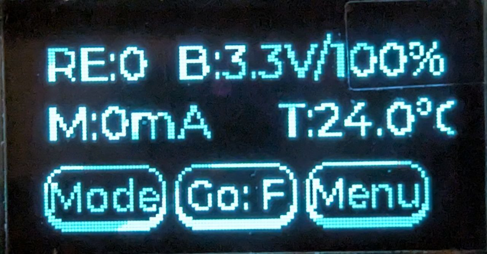

# Integration Tests
This document describes integration test procedures and results for the MiraTherm radiator thermostat project.

## General prerequisites

All tests require the hardware setup shown below:

Follow the software project README to set up the development environment: https://github.com/MiraTherm/miratherm-radiator-thermostat-software/blob/main/README.md

You can view the MCU pin configuration by opening the [.ioc file](https://github.com/MiraTherm/miratherm-radiator-thermostat-software/blob/main/mt-rt.ioc) in STM32CubeMX.

Unless otherwise specified in the test procedure: If settings are stored in permanent memory, a factory reset should be performed before each test (`Menu` -> `Factory Reset`).

## Test procedures

|ID|Name|REQ|Prerequisites|Test procedure|Expected behavior|
|--|----|---|-------------|--------------|-----------------|
|1|Display Driver and Measurements Test|1.x, 5.x, 6.x, 8.x| The MCU software is compiled with the `TEST` and `DRIVER_TEST` flags set in [tests.h](https://github.com/MiraTherm/miratherm-radiator-thermostat-software/blob/main/Core/Inc/tests.h). |Start the hardware and observe the display.|The display should show the following output:   The values of `RE` (rotary encoder), `M` (motor current), and `B%` (battery SoC) should match the screenshot exactly. `BV` may vary slightly. `T` may vary due to ambient temperature and measurement error.|
|2| Rotary Encoder Driver Test | 2.x | The MCU software is compiled with the `TEST` and `DRIVER_TEST` flags set in [tests.h](https://github.com/MiraTherm/miratherm-radiator-thermostat-software/blob/main/Core/Inc/tests.h). Test 1 was passed.|Rotate the encoder one tick to the left, then two ticks to the right.|The displayed `RE:0` should change in the following order: 0 → -1 → 0 → 1.|
|3| Buttons Driver Test | 3.x | The MCU software is compiled with the `TEST` and `DRIVER_TEST` flags set in [tests.h](https://github.com/MiraTherm/miratherm-radiator-thermostat-software/blob/main/Core/Inc/tests.h). Test 2 was passed.|Press, briefly hold, and release each button (left: `Mode`, middle: `Go`, right: `Menu`).|While a button is held, the main color should change to white and return to black on release. This applies to each button.|
|4| Motor Driver Test | 4.x, 5.x | The MCU software is compiled with the `TEST` and `DRIVER_TEST` flags set in [tests.h](https://github.com/MiraTherm/miratherm-radiator-thermostat-software/blob/main/Core/Inc/tests.h). Test 3 was passed.|1. Press and hold the `Go` button until the valve reaches its end stop. 2. Press and release `Mode` once. 3. Repeat step 1 in the opposite direction.|1. On `Go` button press, the motor should begin moving the valve. `M` should be greater than zero — 30-50 mA at start, 13-23 mA during movement, and 100–130 mA at the end stop. 2. The label of the `Go` button should toggle between `Go: F` and `Go: R`.|
|5|Home Display Page| 14 | The MCU software is compiled without any flags set in [tests.h](https://github.com/MiraTherm/miratherm-radiator-thermostat-software/blob/main/Core/Inc/tests.h).| Skip COD (Configuration on Device) rotine. To do this, press the middle button 6 times after a device reset/restart. Wait 10 seconds until mocked adaptation is done. | The display should show the following output:   The ambient temperature (value on the right side) may vary.|
|6|Target Temperature Range, Resolution and Valve States| 20 | The MCU software is compiled without any flags set in [tests.h](https://github.com/MiraTherm/miratherm-radiator-thermostat-software/blob/main/Core/Inc/tests.h).| 1. Same as in the test 5.  2. Spin the control wheel clockwise to change the displayed target temperature (value on the left side) to 29.5° and then spin one tick further. 2. Spin the control wheel counterclockwise to change the target temperature to 5.0°, then spin one tick further. | 1. You should see the home display:   2. The target temperature value should change to 29.5° and then to `ON`.  3. The target temperature value should change to 5.0° and then to `OFF`. |
|7|Boost-Mode| 17, 19.x | The MCU software is compiled without any flags set in [tests.h](https://github.com/MiraTherm/miratherm-radiator-thermostat-software/blob/main/Core/Inc/tests.h).| 1. Same as in the test 5.  2. Press the middle button.  3. Press the middle button again.  4. Press the middle button again and wait until the countdown ends. | 1. You should see the home display:   2. You should see the text `Boost Mode` with a countdown from 300 seconds.  3. You should change back to the home screen.  4. You should see the Boost Mode screen again and switch to the home screen when the coundown ends. |

## Test results

|ID|Name|Commit Hash|Status|Comments|
|--|-----------|-----------|------|--------|
|1|Display Driver and Measurements Test|8051fed567254ebcf559fd5246106ed6269e8fe9|✅Passed||
|2|Rotary Encoder Driver Test|8051fed567254ebcf559fd5246106ed6269e8fe9|✅Passed||
|3|Buttons Driver Test|8051fed567254ebcf559fd5246106ed6269e8fe9|✅Passed||
|4|Motor Driver Test|8051fed567254ebcf559fd5246106ed6269e8fe9|✅Passed||