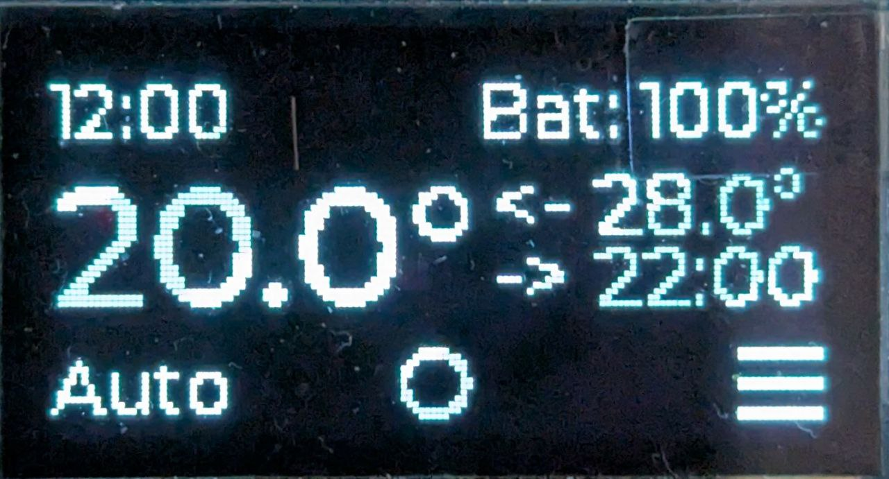

# Integration Tests
This document describes integration test procedures and results for the MiraTherm radiator thermostat project.

## General prerequisites

All tests require the hardware setup shown below:

Follow the software project README to set up the development environment: https://github.com/MiraTherm/miratherm-radiator-thermostat-software/blob/main/README.md

You can view the MCU pin configuration by opening the [.ioc file](https://github.com/MiraTherm/miratherm-radiator-thermostat-software/blob/main/mt-rt.ioc) in STM32CubeMX.

Unless otherwise specified in the test procedure, please ensure the following before starting each test: 
- If settings are stored in permanent memory, a factory reset should be performed before each test (`Menu` -> `Factory Reset`)
- The MCU software is compiled without any flags set in [tests.h](https://github.com/MiraTherm/miratherm-radiator-thermostat-software/blob/main/Core/Inc/tests.h).

## Test procedures

|ID|Name|REQ|Prerequisites|Test procedure|Expected behavior|
|--|----|---|-------------|--------------|-----------------|
|1|Display Driver and Measurements Test|1.x, 5.x, 6.x, 8.x| The MCU software is compiled with the `TEST` and `DRIVER_TEST` flags set in [tests.h](https://github.com/MiraTherm/miratherm-radiator-thermostat-software/blob/main/Core/Inc/tests.h). |Start the hardware and observe the display.|The display should show the following output:   The values of `RE` (rotary encoder), `M` (motor current), and `B%` (battery SoC) should match the screenshot exactly. `BV` may vary slightly. `T` may vary due to ambient temperature and measurement error.|
|2| Rotary Encoder Driver Test | 2.x | The MCU software is compiled with the `TEST` and `DRIVER_TEST` flags set in [tests.h](https://github.com/MiraTherm/miratherm-radiator-thermostat-software/blob/main/Core/Inc/tests.h). Test 1 was passed.|Rotate the encoder one tick to the left, then two ticks to the right.|The displayed `RE:0` should change in the following order: 0 → -1 → 0 → 1.|
|3| Buttons Driver Test | 3.x | The MCU software is compiled with the `TEST` and `DRIVER_TEST` flags set in [tests.h](https://github.com/MiraTherm/miratherm-radiator-thermostat-software/blob/main/Core/Inc/tests.h). Test 2 was passed.|Press, briefly hold, and release each button (left: `Mode`, middle: `Go`, right: `Menu`).|While a button is held, the main color should change to white and return to black on release. This applies to each button.|
|4| Motor Driver Test | 4.x, 5.x | The MCU software is compiled with the `TEST` and `DRIVER_TEST` flags set in [tests.h](https://github.com/MiraTherm/miratherm-radiator-thermostat-software/blob/main/Core/Inc/tests.h). Test 3 was passed.|1. Press and hold the `Go` button until the valve reaches its end stop. 2. Press and release `Mode` once. 3. Repeat step 1 in the opposite direction.|1. On `Go` button press, the motor should begin moving the valve. `M` should be greater than zero — 30-50 mA at start, 10-25 mA during movement, and 100–130 mA at the end stop. 2. The label of the `Go` button should toggle between `Go: F` and `Go: R`.|
|5|Home Display Page| 14, 31 | - | Skip COD (Configuration on Device) rotine. To do this, press the middle button 6 times after a device reset/restart. Wait 10 seconds until mocked adaptation is done. | The display should show the following output:   The ambient temperature (value on the right side) may vary.|
|6|Target Temperature Range, Resolution and Valve States| 20 | - | 1. Same as in the test 5.  2. Spin the control wheel clockwise to change the displayed target temperature (value on the left side) to 29.5° and then spin one tick further. 2. Spin the control wheel counterclockwise to change the target temperature to 5.0°, then spin one tick further. | 1. Same as in the test 5  2. The target temperature value should change to 29.5° in 0.5° steps and then to `ON`.  3. The target temperature value should change to 5.0° and then to `OFF`. |
|7|Boost-Mode| 17, 19.x, 31 | - | 1. Same as in the test 5.  2. Press the middle button.  3. Press the middle button again.  4. Press the middle button again and wait until the countdown ends. | 1. Same as in the test 5  2. You should see the text `Boost Mode` with a countdown from 300 seconds and `X` as hint for the middle button.  3. You should change back to the home screen.  4. You should see the Boost Mode screen again and switch to the home screen when the coundown ends. |
|8|Temperature Offset| 15, 21, 23, 31 | - | 1. Same as in the test 5.  2. Press the right button to enter the menu, then scroll to `Temp offset` and press the middle button.  3. Spin the control wheel clockwise to change the value to -15.0.   4. Spin the control wheel counterclockwise to change the value to +15.0.   5. Press the middle button to save the setting, wait minimum 3 seconds, restart the device and repeat the steps 1 and 2. | 1. Same as in the test 5  2. You should see the selection `Temp Offset 0.0°C` (0.0°C is the factory default value) and `O` as hint for the middle button.  3. The temperature offset value should change to -15.0°C in 0.5°C steps.   4. The temperature offset value should change to +15.0°C.  5. After a device restart, the initial temperature offset value in the `Temp offset` menu item should be +15.0°C as it has been set before the device restart.|
|9|Factory Reset| 23, 24, 31 | The test should be performed directly after the last step in the test 8.| 1. Use the left button to go back to the menu.   2. Scroll to `Factory reset` and press the middle button.   3. Press the middle button to choise `No`.   4. Go to `Factory reset` screen again and choise `Yes`.   5. Skip the COD (see test 5) and then go to the `Temp offset` screen (see test 8 step 2).| 1. After pressing the left button with the hint `<` the software should change back to the menu.   2. The selection `Factory reset?` with `No` as the default option and `Yes` as the second option should be opened.   3. The software should change back to the menu screen.   4. The device should go to the COD after the factory reset.   5. The factory default value of 0.0°C should be shown for the temperature offset.|
|10|COD: Date and Time Setup| 9, 10, 31 | Device reset. | 1. Use control wheel to set Year, Month, Day, Hour, Minute. Press Middle button to confirm each. (The set time should not be 12:0x for further verification)  3. Select "Yes" for Auto Summer/Winter, skip the following COD steps (press the middle button twice) and wait 10 seconds.| 1. Software requests date/time input. Button hint `O` for the middle button is always visible. Button hint `<` is not visible on the first field (year) of the date selection page.    3. After the COD the home screen with the set time in the upper left corner appears.|

## Test results

|ID|Name|Commit Hash|Status|Comments|
|--|-----------|-----------|------|--------|
|1|Display Driver and Measurements Test|8051fed567254ebcf559fd5246106ed6269e8fe9|✅Passed||
|2|Rotary Encoder Driver Test|8051fed567254ebcf559fd5246106ed6269e8fe9|✅Passed||
|3|Buttons Driver Test|8051fed567254ebcf559fd5246106ed6269e8fe9|✅Passed||
|4|Motor Driver Test|8051fed567254ebcf559fd5246106ed6269e8fe9|✅Passed||